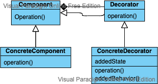

## Simplified Structure




### Design usage
```
interface Liquid
- pour()

Coffee < Liquid
- pour()

interface LiquidAddedFlavour
- flavour

VanillaSyrup
- liquid
- flavour
- pour()

HazelnutSyrup
- liquid
- flavour
- pour

interface ServedTemperature
- temperature

Hot
- liquid
- temperature: 100

Cold
- liquid
- temperature: 10

Coffee.pour() // black coffee

VanillaSyrup(Coffee).pour() // vanilla latte
HazelnutSyrup(Coffee).pour() /; hazelnut latte

Hot(VanillaSyrup(Coffee)).pour() // hot vanilla latte
Cold(VanillaSyrup(Coffee)).pour() // ice vanilla latte

``` 